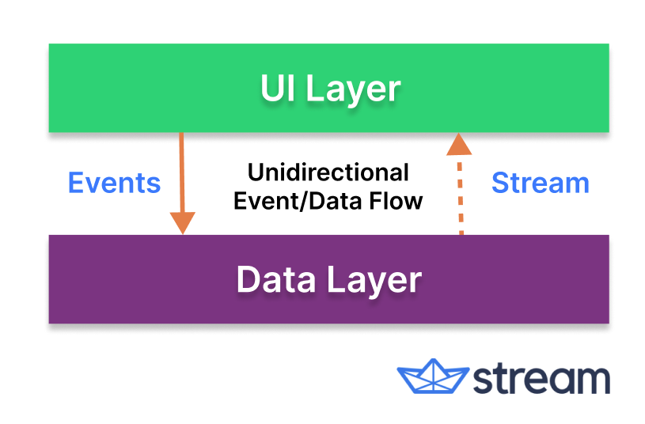
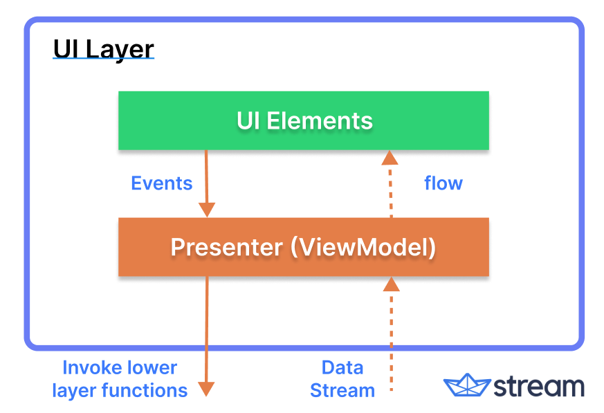
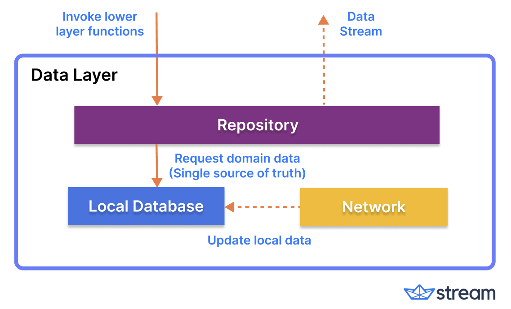

<p align="center">

</p>

<p align="center">
  <a href="https://opensource.org/licenses/Apache-2.0"></a>
  <a href="https://android-arsenal.com/api?level=21"></a>
  <a href="https://mailchi.mp/kotlinweekly/kotlin-weekly-274"></a>
  <a href="https://github.com/skydoves/AvengersChat/actions/workflows/android.yml"></a>
  <a href="https://getstream.io/tutorials/android-chat?utm_source=Github&utm_medium=Github_Repo_Content_Ad&utm_content=Developer&utm_campaign=Github_Sept2022_AvengersChat&utm_term=DevRelOss"></a>
</p>

AvengersChat demonstrates modern Android development based on MVVM architecture and [Stream Chat SDK for Android](https://getstream.io/tutorials/android-chat).

The purpose of this repository is to demonstrate below:

- Implementing each different feature with modularization and navigation.
- Implementation of Android architecture components with Jetpack libraries, such as Hilt and AppStartup.
- Performing background tasks with Kotlin Coroutines.
- Integrating chat systems with [Stream Chat SDK for Android](https://getstream.io/tutorials/android-chat) for real-time event handling.

## ✍️ Tutorials


You can learn more about this project from the [blog posts](https://github.com/GetStream/AvengersChat/blob/main/TUTORIAL.md#stream-blog-contents) and [Youtube videos](https://github.com/GetStream/AvengersChat/blob/main/TUTORIAL.md#stream-developers-youtube-channel).
If you're interested in the materials, check out the **[Tutorials Page](https://github.com/GetStream/AvengersChat/blob/main/TUTORIAL.md)**!

## :bulb: Additional Repositories

If you're interested in additional repositories that were built with Jetpack Compose and Stream SDK, check out the repositories below:

- [WhatsApp Clone Android](https://github.com/getStream/whatsApp-clone-compose): 📱 WhatsApp clone project demonstrates modern Android development built with Jetpack Compose and Stream Chat SDK for Compose.
- [Slack Clone Android](https://github.com/GetStream/stream-slack-clone-android): 📱 A chat demo app built with Jetpack Compose and Stream Chat SDK following clean architecture principles.
- [Stream Draw Android](https://github.com/getStream/stream-draw-android): 🛥 Stream Draw is a real-time multiplayer drawing & chat game app built entirely with Jetpack Compose.
- [Facebook Messenger Clone](https://github.com/MathRoda/Messenger-clone): Facebook Messenger clone using Stream SDK & Jetpack Compose.

## 📲 Download APK
Go to the [Releases](https://github.com/getStream/AvengersChat/releases) to download the latest APK.

<a href="https://getstream.io/tutorials/android-chat?utm_source=Github&utm_medium=Github_Repo_Content_Ad&utm_content=Developer&utm_campaign=Github_Sept2022_AvengersChat&utm_term=DevRelOss">

</a>

## ⛴ Stream Chat SDK for Android
AvengersChat was built with [Stream Chat SDK for Android](https://getstream.io/tutorials/android-chat/) for implementing messaging systems. You can learn more about the SDK with the materials below:
- [Chat Messaging Tutorial](https://getstream.io/tutorials/android-chat/?utm_source=Github&utm_campaign=Devrel_oss&utm_medium=avengerschat): Basic tutorials for getting started by building a simple messaging app.
- [Stream Chat Android repository](https://github.com/GetStream/stream-chat-android): Official Android SDK for Stream Chat.
- [Chat Client Documentation](https://getstream.io/chat/docs/android/?language=kotlin): Full documentation of the Chat client for requesting API calls. 
- [UI Components Documentation](https://getstream.io/chat/docs/sdk/android/): Full documentation of the Stream UI Components.
- [UI Components Sample](https://github.com/GetStream/stream-chat-android/tree/main/stream-chat-android-ui-components-sample): Official sample app for building messaging app.

## 📷 Previews

If you find funny moments on this demo application, feel free to join and share the moment in [this thread](https://github.com/skydoves/AvengersChat/discussions/1)!

<p align="center">


</p>

<p align="center">


</p>


## 🛠 Tech stack & Open source libraries

- Minimum SDK level 21.
- 100% [Kotlin](https://kotlinlang.org/) based + [Coroutines](https://github.com/Kotlin/kotlinx.coroutines) + [Flow](https://kotlin.github.io/kotlinx.coroutines/kotlinx-coroutines-core/kotlinx.coroutines.flow/) for asynchronous.
- Hilt for dependency injection.
- Jetpack
  - Lifecycle: Dispose observing data when lifecycle state changes.
  - ViewModel: UI related data holder and lifecycle aware.
  - App Startup: Provides a straightforward, performant way to initialize components at application startup.
  - Navigation: For navigating screens and provides deeplinks. 
  - Room: Constructs Database by providing an abstraction layer over SQLite to allow fluent database access.
  - [Hilt](https://dagger.dev/hilt/): Dependency Injection.
- Architecture
  - MVVM Architecture: View - DataBinding - ViewModel - Model
  - [Bindables](https://github.com/skydoves/bindables): Android DataBinding kit for notifying data changes to UI layers.
  - Repository pattern
- [Material Design & Animations](https://material.io/design): Design system created by Google to help teams build high-quality digital experiences.
- [Retrofit2 & OkHttp3](https://github.com/square/retrofit): Construct the REST APIs and paging network data.
- [Sandwich](https://github.com/skydoves/Sandwich): Construct lightweight http API response and handling error responses.
- [Moshi](https://github.com/square/moshi/): A modern JSON library for Kotlin and Java.
- [Coil](https://github.com/coil-kt/coil): Image loading for Android backed by Kotlin Coroutines.
- [TransformationLayout](https://github.com/skydoves/transformationlayout): Implementing transformation motion animations.
- [android-youtube-player](https://github.com/PierfrancescoSoffritti/android-youtube-player): YouTube Player library for Android and Chromecast, stable and customizable.
- [DiscreteScrollView](https://github.com/yarolegovich/DiscreteScrollView): Implementing a scrollable list of items.
- [Timber](https://github.com/JakeWharton/timber): A logger with a small, extensible API which provides utility.


## ✅ Supported features
- Light and Dark themes.
- Different color themes by a chosen character.
- 100% offline mode supports.
- Live stream chat example.
- Channel and message lists.
- Direct message and group messages.
- Mentioned message list.
- Custom emoji reactions.
- Guest mode.
- User online/offline status.
- User last active date.
- User info & direct message dialogs.
- Visual animations like transition.
- And a lot of features by Stream Android SDK!

## ☑️ TODO
Anyone can contribute to our open source project! Please kindly read this [Contributing Guideline](https://github.com/skydoves/AvengersChat/blob/main/CONTRIBUTING.md) before contributing to our project. 😎
- [x] Modify a user profile image.
- [x] Login with a new guest user.
- [x] Push notifications for new messages.
- [ ] Create group chats by selecting users.
- [ ] Access user info dialog everywhere.
- [ ] Add unit test cases for all business logic.

## 🏛 Architecture



- Each layer follows [unidirectional event/data flow](https://developer.android.com/topic/architecture/ui-layer#udf); the UI layer emits user events to the data layer, and the data layer exposes data as a stream to other layers.
- The data layer is designed to work independently from other layers and must be pure, which means it doesn't have any dependencies on the other layers.

With this loosely coupled architecture, you can increase the reusability of components and scalability of your app.

### UI Layer



The UI layer consists of UI elements to configure screens that could interact with users and [ViewModel](https://developer.android.com/topic/libraries/architecture/viewmodel) that holds app states and restores data when configuration changes.
- UI elements observe the data flow via [DataBinding](https://developer.android.com/topic/libraries/data-binding), which is the most essential part of the MVVM architecture. 
- With [Bindables](https://github.com/skydoves/bindables), which is an Android DataBinding kit for notifying data changes, you can implement two-way binding, and data observation in XML very clean.

### Data Layer



The data Layer consists of repositories, which include business logic, such as querying data from the local database and requesting remote data from the network. It is implemented as an offline-first source of business logic and follows the [single source of truth](https://en.wikipedia.org/wiki/Single_source_of_truth) principle.<br>

**Pokedex** is an offline-first app is an app that is able to perform all, or a critical subset of its core functionality without access to the internet. 
So users don't need to be up-to-date on the network resources every time and it will decrease users' data consumption. For further information, you can check out [Build an offline-first app](https://developer.android.com/topic/architecture/data-layer/offline-first).

## 💯 MAD Score


## Content Credits
All copyrights of the contents, concepts, and phrases that are used in this open-source project belong to [Marvel Studios](https://www.marvel.com/).

## Find this repository useful? 💙
Support it by joining __[stargazers](https://github.com/skydoves/AvengersChat/stargazers)__ for this repository. :star: <br>
Also, follow __[maintainers](https://github.com/skydoves)__ on GitHub for our next creations! 🤩

# License
```xml
Copyright 2021 Stream.IO, Inc. All Rights Reserved.

Licensed under the Apache License, Version 2.0 (the "License");
you may not use this file except in compliance with the License.
You may obtain a copy of the License at

   http://www.apache.org/licenses/LICENSE-2.0

Unless required by applicable law or agreed to in writing, software
distributed under the License is distributed on an "AS IS" BASIS,
WITHOUT WARRANTIES OR CONDITIONS OF ANY KIND, either express or implied.
See the License for the specific language governing permissions and
limitations under the License.
```

